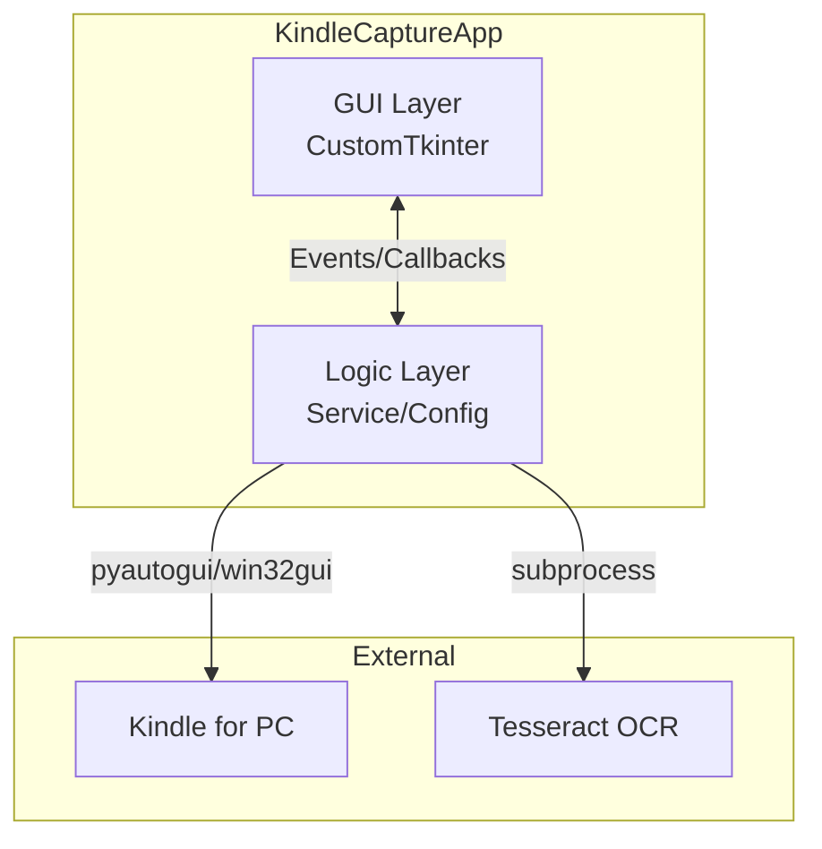
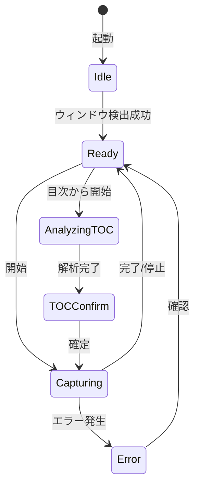

# 機能仕様書（FS: Functional Specification）

| 項目 | 内容 |
|------|------|
| 文書番号 | FS-KINDLE-001 |
| バージョン | 1.1 |
| 作成日 | 2024-12-06 |
| 関連文書 | RD-KINDLE-001 |

---

## 1. システム概要

### 1.1 システム構成



### 1.2 技術スタック

| レイヤー | 技術 |
|---------|------|
| UIフレームワーク | CustomTkinter (Python) |
| コアロジック | kindle_capture パッケージ |
| 非同期処理 | threading (キャプチャ処理のバックグラウンド化) |
| OCR | Tesseract OCR (目次解析) |

---

## 2. 画面仕様

### 2.1 画面一覧

| 画面ID | 画面名 | 説明 |
|--------|--------|------|
| SCR-001 | メイン画面 | キャプチャ操作の中心画面。プレビュー、進捗表示を含む |
| SCR-002 | 設定ダイアログ | キャプチャ間隔、重複検知、PDF方向などの設定 |
| SCR-003 | クロップ調整ダイアログ | キャプチャ範囲（黒帯除去）の調整とプレビュー |
| SCR-004 | 目次確認ダイアログ | OCR解析された目次情報の確認・修正 |

### 2.2 メイン画面 (SCR-001)

#### レイアウト概念図

```
+--------------------------------------------------+
|  🔖 Kindle Capture                    [⚙️設定]    |
+--------------------------------------------------+
|                                                  |
|  📚 Kindleウィンドウ: [検出済み (1200x900) ✓]    |
|       [🔄 再検出]                                |
|                                                  |
|  [📐 クロップ調整（黒帯除去）]                   |
|                                                  |
|  +--------------------------------------------+  |
|  |         [ プレビュー エリア ]              |  |
|  |   (キャプチャされた最新ページを表示)       |  |
|  +--------------------------------------------+  |
|                                                  |
|  モード: ○ 自動  ○ ページ数指定 [___]          |
|                                                  |
|  出力ファイル: [book_title.pdf    ] [📁参照]    |
|                                                  |
|  進捗: [████████████░░░░░░░] 45/120 ページ      |
|                                                  |
|  [▶️ キャプチャ開始] [📖 目次から開始] [⏹️ 停止]|
|                                                  |
+--------------------------------------------------+
```

#### UI要素

| 要素 | 種類 | 説明 |
|------|------|------|
| 再検出ボタン | Button | Kindleウィンドウを再検索し、書籍タイトルを取得 |
| クロップ調整ボタン | Button | SCR-003を開く |
| モード選択 | Radio | 「自動（最後まで）」または「ページ数指定」 |
| ファイル選択 | Entry/Button | 出力先を指定。書籍タイトルが自動入力される |
| キャプチャ開始 | Button | 指定モードでキャプチャを開始 |
| 目次から開始 | Button | OCRで目次を読み取ってから開始 (SCR-004へ遷移) |
| 停止 | Button | キャプチャを安全に中断し、そこまでのPDFを作成 |

---

## 3. モジュールインターフェース

本アプリケーションはモノリシックなデスクトップアプリですが、内部的にService層とUI層が分離されています。

### 3.1 KindleCaptureService

| メソッド | 説明 |
|----------|------|
| `find_window()` | Kindleウィンドウを検索しハンドルを取得 |
| `detect_toc_page()` | 現在のページをOCR解析し目次情報を抽出 |
| `run()` | キャプチャ処理を実行（ブロッキング/別スレッド推奨） |
| `turn_next_page()` | 次のページへ遷移させる |

### 3.2 イベント通知 (Callback)

`run()` メソッドには `progress_callback` を渡すことができ、以下の情報をGUIに通知します。

- 現在のページ数
- 全ページ数（既知の場合）
- 中断リクエストの状態

---

## 4. 状態遷移



---

## 5. エラー処理

エラー発生時はGUI上のダイアログ (`ctk.CTkInputDialog` 等) でユーザーに通知します。

| エラー種別 | 原因 | ユーザーへの対応 |
|-----------|------|-------------------|
| WindowNotFoundError | Kindleが起動していない | Kindleを起動して「再検出」を押下 |
| TesseractNotFoundError | Tesseract未インストール | インストールURLを案内 |
| PermissionError | ファイルが開かれている | PDFを閉じてから再試行 |
