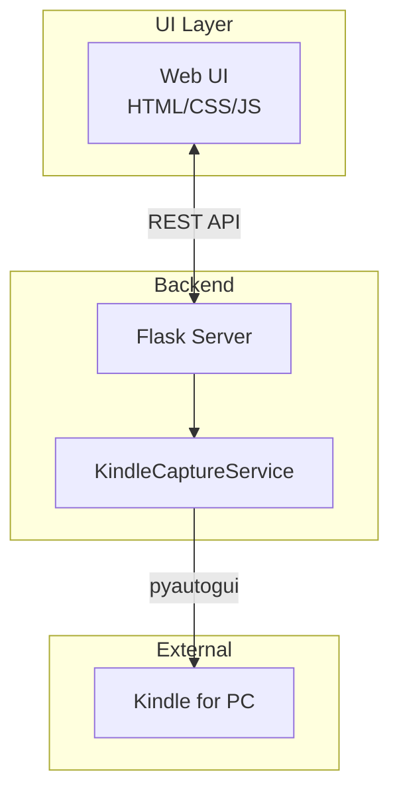
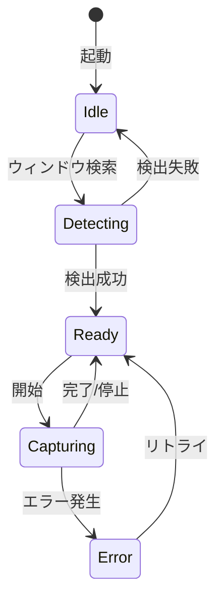

# 機能仕様書（FS: Functional Specification）

| 項目 | 内容 |
|------|------|
| 文書番号 | FS-KINDLE-001 |
| バージョン | 1.0 |
| 作成日 | 2024-12-06 |
| 関連文書 | RD-KINDLE-001 |

---

## 1. システム概要

### 1.1 システム構成



### 1.2 技術スタック

| レイヤー | 技術 |
|---------|------|
| UIフレームワーク | CustomTkinter |
| コアロジック | kindle_capture パッケージ |
| 非同期処理 | threading |

---

## 2. 画面仕様

### 2.1 画面一覧

| 画面ID | 画面名 | 説明 |
|--------|--------|------|
| SCR-001 | メイン画面 | キャプチャ操作の中心画面 |
| SCR-002 | 設定画面 | パラメータ設定用モーダル |

### 2.2 メイン画面 (SCR-001)

#### レイアウト

```
+--------------------------------------------------+
|  🔖 Kindle Capture                    [⚙️設定]    |
+--------------------------------------------------+
|                                                  |
|  📚 Kindleウィンドウ: [検出済み ✓]               |
|                                                  |
|  +--------------------------------------------+  |
|  |                                            |  |
|  |         [ プレビュー エリア ]              |  |
|  |                                            |  |
|  +--------------------------------------------+  |
|                                                  |
|  モード: ○ 自動  ○ ページ数指定 [___]          |
|                                                  |
|  出力ファイル: [output.pdf        ] [📁参照]    |
|                                                  |
|  進捗: ████████████░░░░░░░  45%  (45/100)       |
|                                                  |
|  [▶️ キャプチャ開始]  [⏹️ 停止]                  |
|                                                  |
+--------------------------------------------------+
```

#### UI要素

| ID | 要素 | 種類 | 動作 |
|----|------|------|------|
| btn-start | 開始ボタン | Button | キャプチャ開始 |
| btn-stop | 停止ボタン | Button | キャプチャ中断 |
| radio-mode | モード選択 | Radio | 自動/指定切替 |
| input-pages | ページ数 | Number | 指定ページ数入力 |
| input-output | 出力ファイル | Text | ファイル名入力 |
| progress-bar | 進捗バー | Progress | 進捗表示 |
| preview-area | プレビュー | Image | 最新キャプチャ表示 |

---

## 3. API仕様

### 3.1 エンドポイント一覧

| メソッド | パス | 説明 |
|---------|------|------|
| GET | `/api/status` | システム状態取得 |
| POST | `/api/capture/start` | キャプチャ開始 |
| POST | `/api/capture/stop` | キャプチャ停止 |
| GET | `/api/config` | 設定取得 |
| PUT | `/api/config` | 設定更新 |

### 3.2 WebSocketイベント

| イベント | 方向 | 説明 |
|---------|------|------|
| `progress` | Server→Client | 進捗更新通知 |
| `preview` | Server→Client | プレビュー画像更新 |
| `complete` | Server→Client | 完了通知 |
| `error` | Server→Client | エラー通知 |

### 3.3 API詳細

#### POST /api/capture/start

**リクエスト:**
```json
{
  "mode": "auto" | "fixed",
  "pages": 10,
  "output_filename": "output.pdf"
}
```

**レスポンス:**
```json
{
  "status": "started",
  "session_id": "abc123"
}
```

---

## 4. 状態遷移



---

## 5. エラー処理

| エラーコード | 説明 | ユーザーメッセージ |
|-------------|------|-------------------|
| E001 | ウィンドウ未検出 | Kindleを起動してください |
| E002 | キャプチャ失敗 | 画面のキャプチャに失敗しました |
| E003 | PDF生成失敗 | PDFの生成に失敗しました |
| E004 | ファイル書込エラー | ファイルを保存できません |
