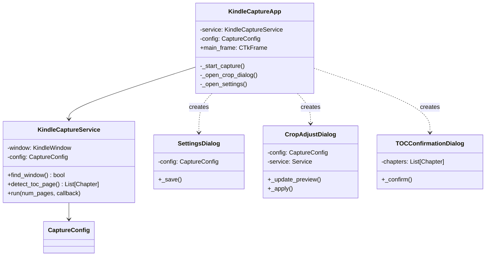
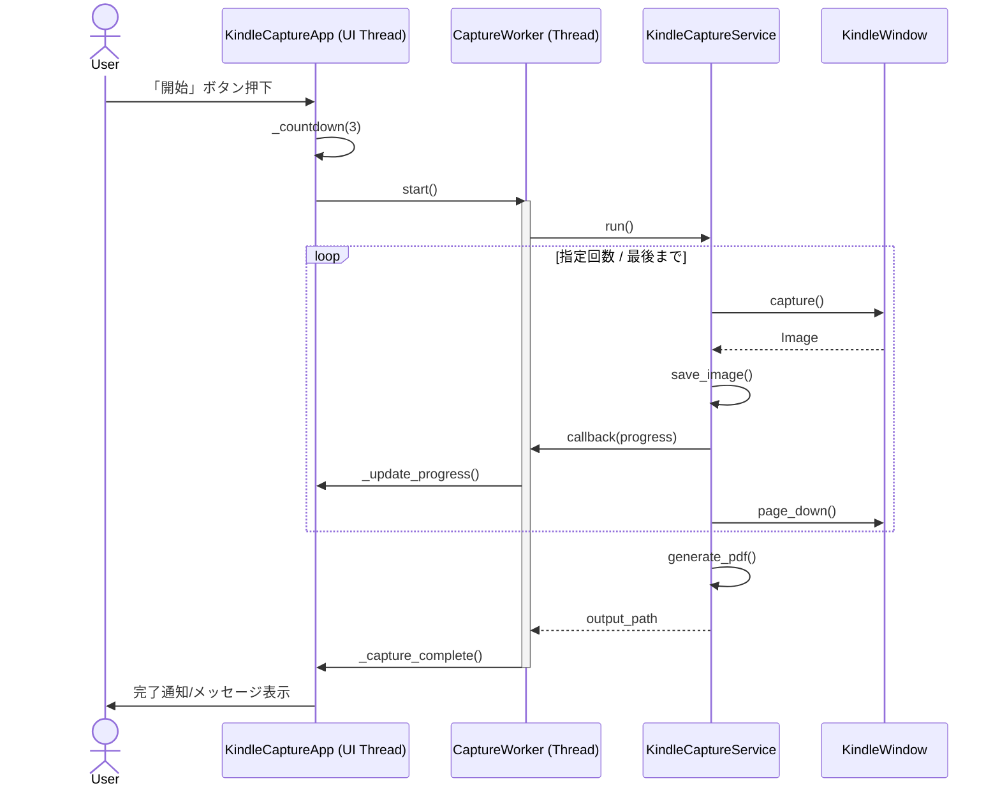

# 詳細設計書（DD: Detailed Design）

| 項目 | 内容 |
|------|------|
| 文書番号 | DD-KINDLE-001 |
| バージョン | 1.1 |
| 作成日 | 2024-12-06 |
| 関連文書 | FS-KINDLE-001 |

---

## 1. ディレクトリ構成

```
kindle/
├── kindle_capture/          # コアロジック
│   ├── __init__.py
│   ├── config.py            # CaptureConfig
│   ├── window.py            # win32guiラッパー
│   ├── capture.py           # キャプチャ/画像処理
│   ├── pdf_generator.py     # PDF結合
│   ├── toc_parser.py        # 目次OCR解析
│   └── exceptions.py
├── gui/                     # UI層 (CustomTkinter)
│   ├── __init__.py
│   ├── app.py               # メインアプリ(KindleCaptureApp)
│   ├── toc_dialog.py        # 目次確認ダイアログ
│   └── components/
│       ├── __init__.py
│       ├── settings_dialog.py   # 設定ダイアログ
│       └── crop_dialog.py       # クロップ調整ダイアログ
├── tests/                   # テスト
├── docs/                    # ドキュメント
├── run_gui.py               # 起動スクリプト
└── requirements.txt
```

---

## 2. クラス設計

### 2.1 クラス図



---

## 3. シーケンス図

### 3.1 キャプチャ実行フロー



---

## 4. コンポーネント詳細

### 4.1 KindleCaptureApp (gui/app.py)

アプリケーションのメインエントリーポイント。`ctk.CTk` を継承します。

- **責任**: メインウィンドウの描画、イベントハンドリング、オーケストレーション
- **主要属性**:
    - `_config`: アプリケーション設定
    - `_service`: キャプチャロジックへのインターフェース
    - `_capture_thread`: キャプチャ処理用スレッド

### 4.2 設定・調整ダイアログ

- `SettingsDialog`: `ctk.CTkToplevel`継承。キャプチャ間隔やPDF方向、クロップ設定への導線を提供。
- `CropAdjustDialog`: プレビューを見ながら上下左右のマージン（クロップ量）を調整可能。変更は一時的に適用され、キャンセル時は元に戻る。

### 4.3 目次解析機能 (TOC)

Tesseract OCRを使用して目次ページを解析します。

1. `KindleCaptureService.detect_toc_page()` が現在の画面をOCR。
2. 正規表現で「第N章...123」のようなパターンを抽出。
3. `TOCConfirmationDialog` でユーザーが修正。
4. 修正された `List[Chapter]` を `run()` に渡し、PDF生成時にしおりとして埋め込む。

---

## 5. エラーハンドリング構想

GUIアプリケーションとして、ユーザーに分かりやすいエラー表示を行います。

- **検知不能**: ステータスバーに赤字で通知。「再検出」を促す。
- **実行時エラー**: キャプチャスレッド内の例外をキャッチし、メインスレッドのコールバック経由で `ctk.CTkInputDialog` (またはメッセージボックス) を表示して通知。
