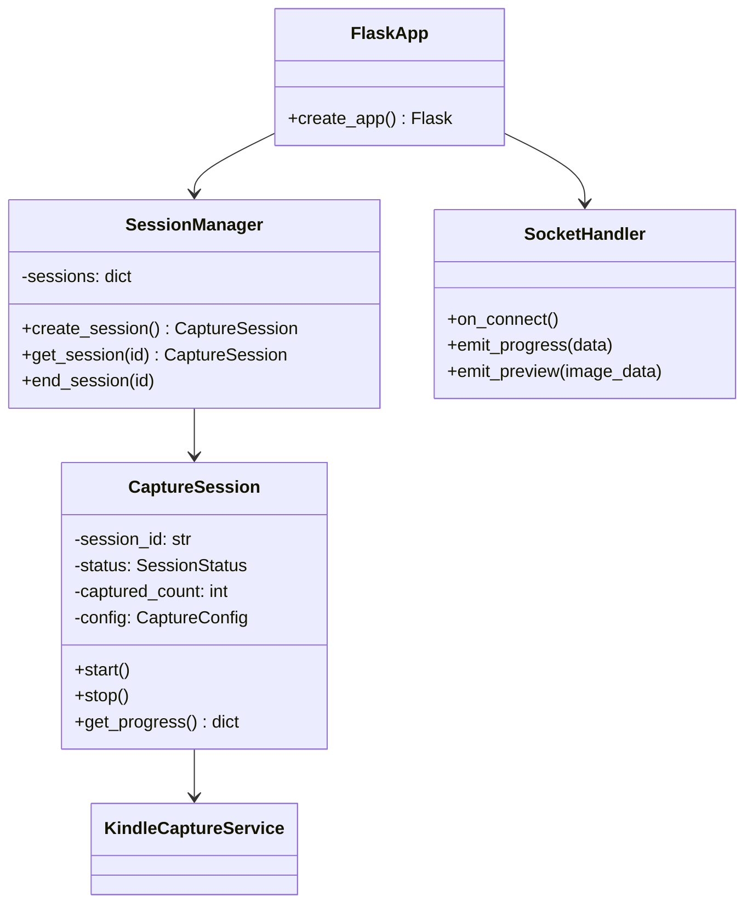
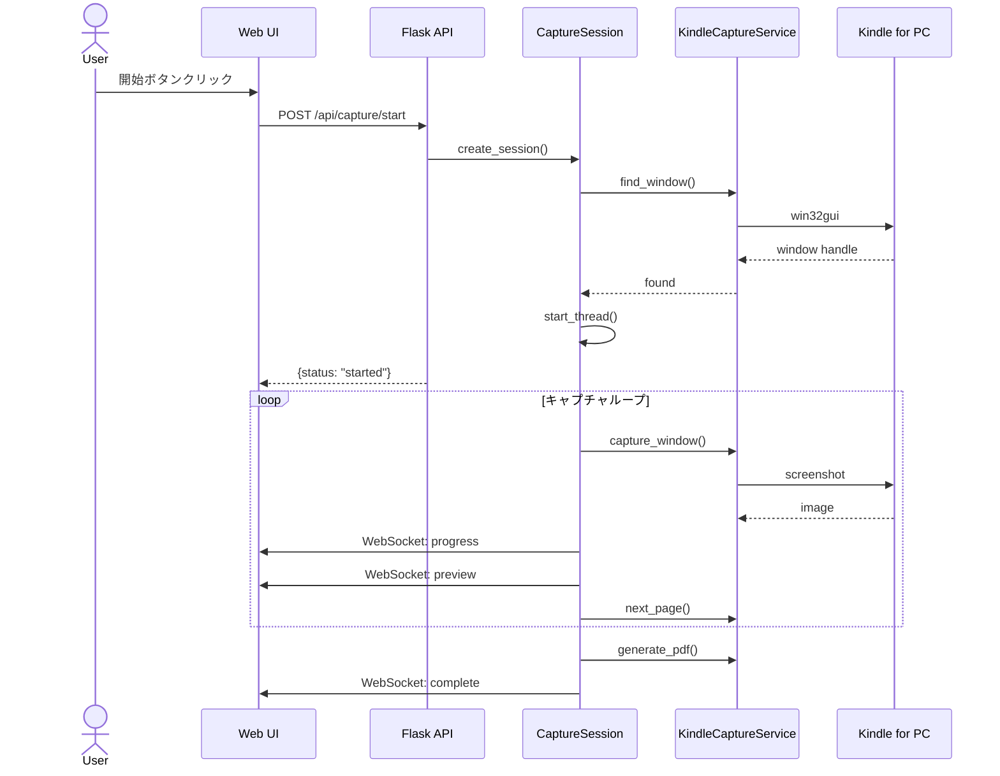

# 詳細設計書（DD: Detailed Design）

| 項目 | 内容 |
|------|------|
| 文書番号 | DD-KINDLE-001 |
| バージョン | 1.1 |
| 作成日 | 2024-12-06 |
| 関連文書 | FS-KINDLE-001 |

---

## 1. ディレクトリ構成

```
kindle/
├── kindle_capture/          # コアパッケージ（既存）
│   ├── __init__.py
│   ├── config.py
│   ├── window.py
│   ├── capture.py
│   ├── pdf_generator.py
│   └── exceptions.py
├── gui/                     # デスクトップUI
│   ├── __init__.py
│   └── app.py               # CustomTkinterアプリ
├── tests/
│   ├── features/
│   │   ├── capture.feature
│   │   └── ui.feature
│   ├── step_defs/
│   ├── test_unit.py
│   └── test_gui.py
├── docs/                    # ドキュメント
├── run_gui.py               # GUI起動スクリプト
├── main.py                  # CLI
└── config.yaml
```

---

## 2. クラス設計

### 2.1 クラス図



### 2.2 CaptureSession クラス

```python
class CaptureSession:
    """キャプチャセッションを管理"""
    
    class Status(Enum):
        IDLE = "idle"
        RUNNING = "running"
        PAUSED = "paused"
        COMPLETED = "completed"
        ERROR = "error"
    
    def __init__(self, config: CaptureConfig):
        self.session_id = str(uuid.uuid4())
        self.status = self.Status.IDLE
        self.captured_count = 0
        self.total_pages = None
        self._service = KindleCaptureService(config)
        self._thread = None
    
    def start(self, mode: str, pages: int = None) -> None:
        """キャプチャを開始"""
        pass
    
    def stop(self) -> None:
        """キャプチャを停止"""
        pass
    
    def get_progress(self) -> dict:
        """進捗情報を取得"""
        pass
```

---

## 3. シーケンス図

### 3.1 キャプチャ開始フロー



---

## 4. 画面コンポーネント設計

### 4.1 CSSカスタムプロパティ（デザイントークン）

```css
:root {
    /* カラーパレット */
    --color-primary: #6366f1;      /* インディゴ */
    --color-primary-dark: #4f46e5;
    --color-success: #22c55e;
    --color-error: #ef4444;
    --color-warning: #f59e0b;
    
    /* 背景 */
    --bg-primary: #0f172a;         /* ダークブルー */
    --bg-secondary: #1e293b;
    --bg-card: #334155;
    
    /* テキスト */
    --text-primary: #f8fafc;
    --text-secondary: #94a3b8;
    
    /* 効果 */
    --shadow-glow: 0 0 20px rgba(99, 102, 241, 0.3);
    --border-radius: 12px;
}
```

### 4.2 コンポーネント構成

| コンポーネント | 責務 |
|---------------|------|
| Header | タイトル、設定ボタン |
| StatusIndicator | Kindle検出状態表示 |
| PreviewArea | キャプチャ画像プレビュー |
| ModeSelector | 自動/ページ数指定切替 |
| FileSelector | 出力ファイル設定 |
| ProgressBar | 進捗表示 |
| ControlButtons | 開始/停止ボタン |
| SettingsModal | 設定モーダル |

---

## 5. 非同期処理設計

### 5.1 スレッド構成

| スレッド | 役割 |
|---------|------|
| Main Thread | Flask/SocketIO サーバー |
| Capture Thread | キャプチャ処理（セッションごと） |

### 5.2 スレッド間通信

```python
# イベントベースの通信
class CaptureSession:
    def __init__(self):
        self._stop_event = threading.Event()
        self._progress_callback = None
    
    def _capture_loop(self):
        while not self._stop_event.is_set():
            # キャプチャ処理
            if self._progress_callback:
                socketio.emit('progress', self.get_progress())
```

---

## 6. セキュリティ考慮

| 項目 | 対策 |
|------|------|
| ローカル専用 | localhost のみでリッスン |
| CSRF | 同一オリジンのみ許可 |
| ファイルパス | パストラバーサル防止 |
